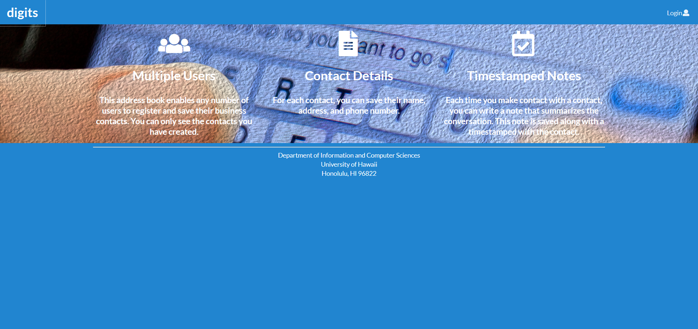
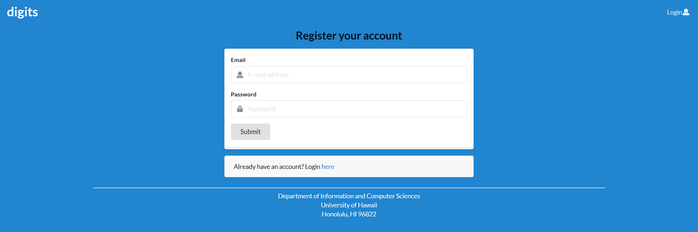
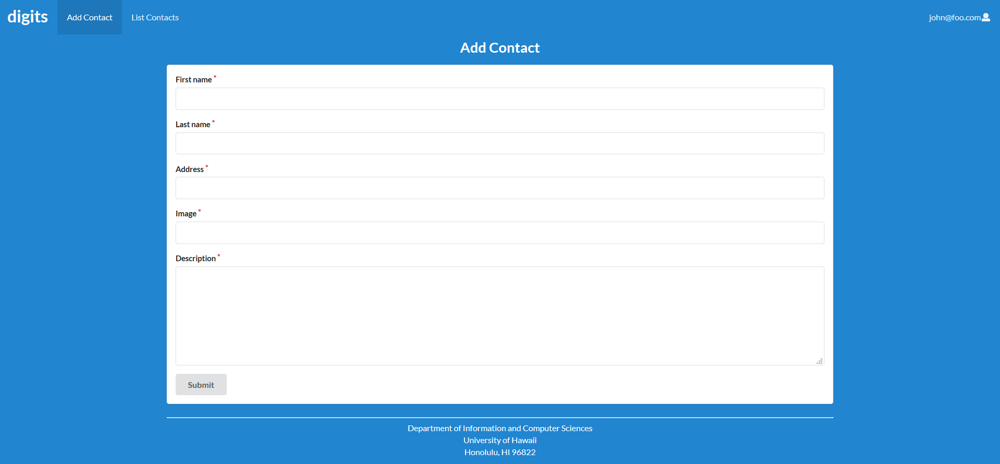
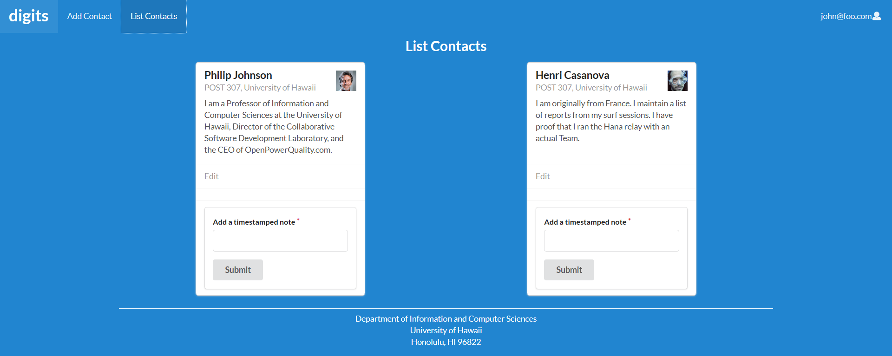

#Digits Walkthrough 

##Installation
Install Meteor.

$ meteor npm install

Create a new Github repository and clone into workspace. Download the zip file and extract all files. Copy over the app directory, config directory, and the gitignore file onto the workspace.

##Running Digits Application
To run the digits application, cd into the app directory located in the digits folder. Then run the following command.

$ meteor npm run start

The application will be running and viewed at: http://localhost:3000/

##Landing Page

The landing page briefly talks about what the application can do. To fully use the application, one must have an account to start. Clicking on the Login button on the top right corner of the page, gives two options. Sign up is to register a newly created account. Sign in is to enter the application with an existing account.

##Sign in/Sign up Page

For the Sign up Page, enter an email and a password that will be used for the account. For the Sign in Page, enter an email and a password corresponding to the account. Click the Submit button when each text fields are completed.

##Add Contact/Edit Contact Page

After the user is logged in, one of the pages that can be accessed is the Add Contact Page. You can add a contact by filling in all the required text fields corresponding to what it asks. For Edit Contact Page, each text fields displayed is what the user previously entered. To edit contact, simply change the text fields arbitrarily. Click the Submit button when each text fields are completed. This will result to adding a contact towards your list.

##List Contacts Page

After the user is logged in, another one of the pages that can be accessed is the List Contacts Page. 
The page displays all the contacts added by the user. Below the description text, the edit link will lead to the Edit Contact Page specific to the contact.

####Timestamped Note
At the end of each contact card, there is a timestamped note that can be added specific to the contact. 
To do so, fill in the text field description and click the submit button. Afterwards, the text field description will be displayed along with the timestampted date.
